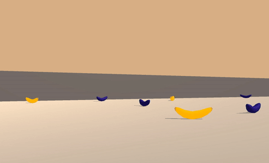

# Udacity Deep Reinforcement Learning course - Project 1: Navigation



This repository contains my solution for the first project of Udacity's course on Reinforcement Learning. The scenario consists of an agent navigating an environment collecting yellow bananas while avoiding blue bananas.

## Contents
This repo contains:
* `dqn.py` - where the majority of the agent's code is stored
* `model.py` - file containing the model used
* `setup.sh` - bash script that prepares your coding environment
* `train.py` - jupyter notebook/script with the code required to train the agent
## Getting Started

This project was developed and tested on an Apple Macbook with an intel i5. No guarantees are made on performance in other systems. 

### Mac

To setup your coding evironment you need to perform 3 steps after cloning this repository:

1. Make `setup.sh` executable. There are many ways to do this. One way is through the terminal run this command:

```bash
chmod +x setup.py
```

2. Then you simply run `setup.py`.

3. Finally you activate the conda environment in your terminal or on your notebook change the kernel to `drl_navigation`
### Others

If you are running this on other operating systems. There's a strong possibility that you can just follow the instructions for mac. Otherwise you will need to follow the steps in the [readme](Value-based-methods/README.md) in the `Value-based-methods` repo.

#### To download the environment for other Operating Systems
If you are using anothe OS you'll need to manually download the environment from one of the links below.  You need only select the environment that matches your operating system:
    - Linux: [click here](https://s3-us-west-1.amazonaws.com/udacity-drlnd/P1/Banana/Banana_Linux.zip)
    - Windows (32-bit): [click here](https://s3-us-west-1.amazonaws.com/udacity-drlnd/P1/Banana/Banana_Windows_x86.zip)
    - Windows (64-bit): [click here](https://s3-us-west-1.amazonaws.com/udacity-drlnd/P1/Banana/Banana_Windows_x86_64.zip)
    
(_For Windows users_) Check out [this link](https://support.microsoft.com/en-us/help/827218/how-to-determine-whether-a-computer-is-running-a-32-bit-version-or-64) if you need help with determining if your computer is running a 32-bit version or 64-bit version of the Windows operating system.

(_For AWS_) If you'd like to train the agent on AWS (and have not [enabled a virtual screen](https://github.com/Unity-Technologies/ml-agents/blob/master/docs/Training-on-Amazon-Web-Service.md)), then please use [this link](https://s3-us-west-1.amazonaws.com/udacity-drlnd/P1/Banana/Banana_Linux_NoVis.zip) to obtain the environment.


## The Environment

The simulation environment was created in Unity and is available [here](https://github.com/Taxuspt/udacity_reinforcement_learning_navigation/blob/master/Banana.app) (macOS version).

As stated previously the goal of the environment is to collect as many yellow bananas as possible. A reward of +1 is provided for collecting a yellow banana, and a reward of -1 is provided for collecting a blue banana.

For this environment the state vector contains 37 continuous values containing the agent's velocity, along with ray-based perception of objects around the agent's forward direction. The agent can interact with the environment through 4 possible discrete actions: 

0. forward
1. backwards
2. left
3. right 

The environment is considered to be solved when a minimum average score of 13.0 is obtained over 100 consecutive episodes.

## Training and report

The training code can be found in `train.py`. This is a jupyter notebook created with [jupytext](https://github.com/mwouts/jupytext#:~:text=Jupytext%20is%20a%20plugin%20for,Scripts%20in%20many%20languages.) so it can be opened either as a notebook or used as a script. 

The final report can be found in `report.ipynb` and is a regular notebook as required for the delivery of the project.


##### Author

Diogo Oliveira